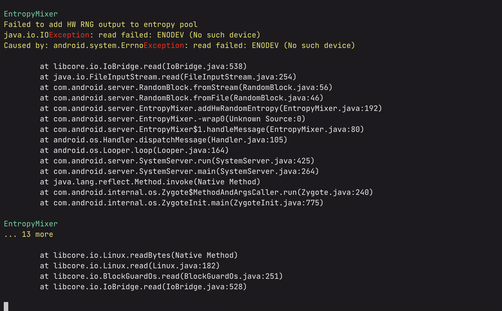
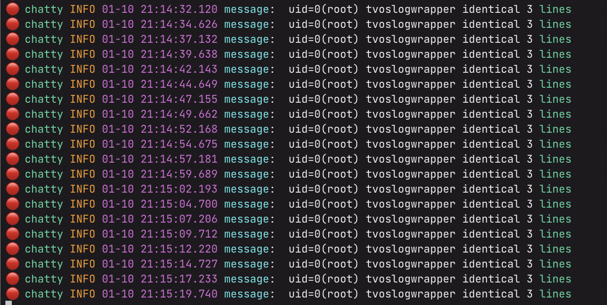
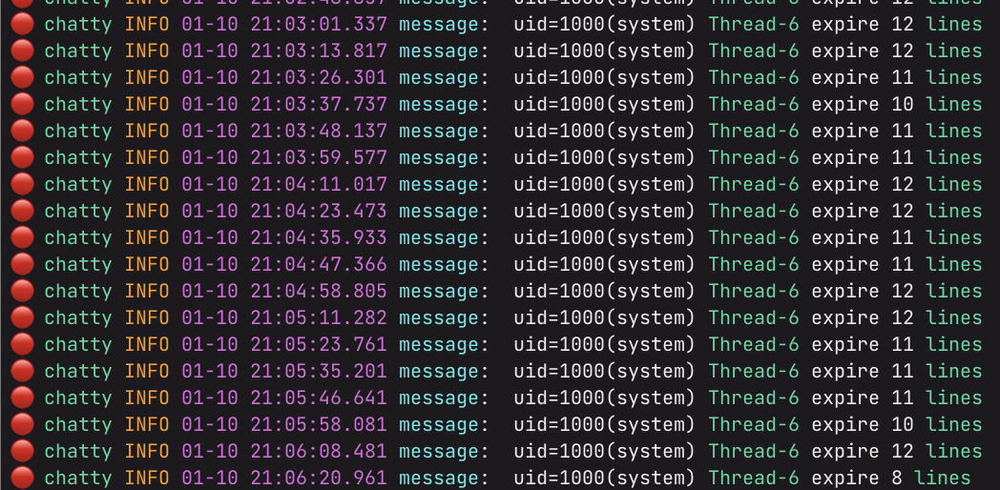
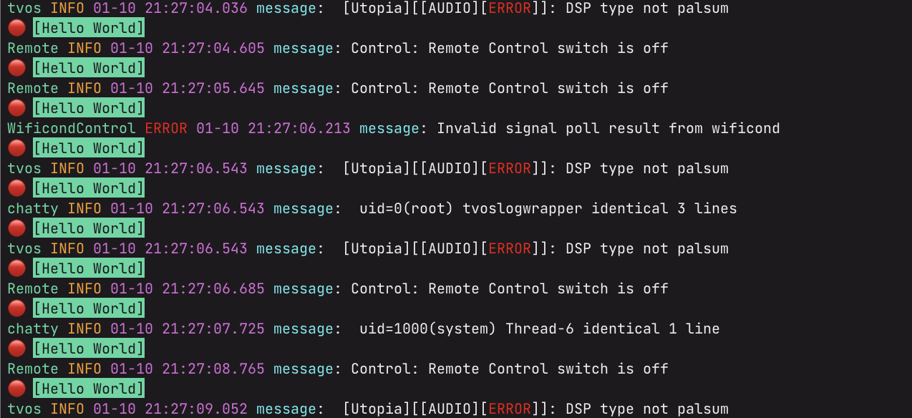
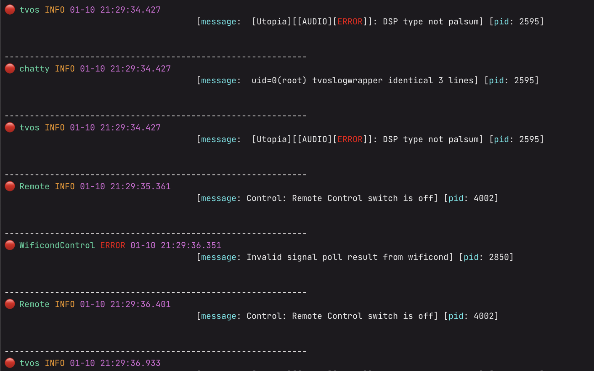
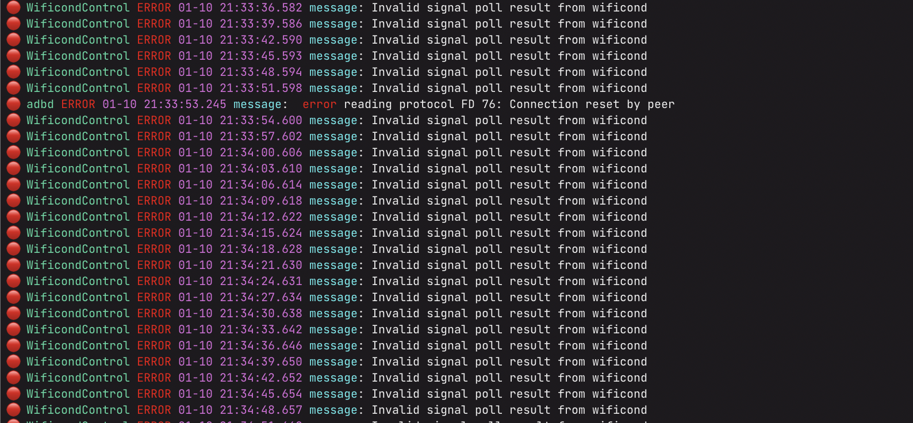

# Nice Log Cat

Just a dog pile of things that help pet the logcat

## Installing

```
pip install -e .
```

## Usage


See `nicelogcat --help` for usage

## Simple

```
adb logcat | nicelogcat --flat
```


## Filter by prefix

```
adb logcat | nicelogcat --flat -p tvos
```


## Record

Hit f12 while nicelogcatting to start and stop recording and write to a log file


## Record only when keys change

```
adb logcat | nicelogcat -p Logger --flat --record-keys x
```


## Nice Stacktraces

```
adb logcat | nicelogcat --flat --stacktrace --disable
```



## All the colors of the Rainbow


## Filter

```
adb logcat | nicelogcat --flat "lines"
```

- Will filter any keys specified



- Restrictive filter with --all

```
adb logcat | nicelogcat --all --flat "lines" "Thread-6"
```




## Custom Titles per Line (if you want)!

```
adb logcat | nicelogcat --flat --show-title-every-line --title "Hello World"
```



## Dividers! Customizations!

```
adb logcat | nicelogcat --divider --linespace 4
```



## Log levels!

```
adb logcat | nicelogcat --flat --level ERROR
```



## More!

More hacks and surprises