# Nice 🪵 Log Cat 🐱

Just a dog pile of things that help pet the logcat

## Installing

```
cd [nicelogcat_directory]
pip install -r requirements.txt
pip install -e .
```

## Usage


See `nicelogcat --help` for usage

```
🍓  nicelogcat --help
usage: nicelogcat [-h] [--title TITLE] [--suspend-util SUSPEND_UTIL] [--spacer {newline,space,tab,pipe}] [-s LINESPACE] [--divider] [--disable] [--flat] [--no-flat]
                  [--raw] [--title-line-color {BLACK,BLUE,CYAN,GREEN,MAGENTA,RED,WHITE,YELLOW}] [--per-line PER_LINE] [--time-per-secs TIME_PER_SECS]
                  [--header-spacer {newline,space}] [-x [FILTEROUT ...]] [--keys [KEYS ...]] [--highlight [HIGHLIGHT ...]] [--h [H ...]] [--record-dir RECORD_DIR]
                  [--record-keys [RECORD_KEYS ...]] [-f [FILTERS ...]] [--filter-any] [-t] [--align-head] [--no-align-head] [--align-simple] [--random] [--randomb]
                  [--random-msg] [--no-random] [--any] [--stacktrace]
                  [-l {e,error,ERROR,w,warn,WARN,d,debug,DEBUG,i,info,INFO,v,verbose,VERBOSE,f,fatal,FATAL,s,silent,SILENT}] [-p [PREFIX ...]]
                  [-i [IGNORE_PREFIX ...]] [--ignore-keys [IGNORE_KEYS ...]] [--num-stack-traces NUM_STACK_TRACES]
                  [filterz ...]

nicelogcat

positional arguments:
  filterz               List of filters

options:
  -h, --help            show this help message and exit
  --title TITLE         Title to show
  --suspend-util SUSPEND_UTIL
                        Suspend until this is found
  --spacer {newline,space,tab,pipe}
                        spacer to use
  -s LINESPACE, --linespace LINESPACE
                        Number of spaces between lines
  --divider             Add a divider per line
  --disable             Disable Print
  --flat                Flat
  --no-flat             No Flat
  --raw                 Include raw line
  --title-line-color {BLACK,BLUE,CYAN,GREEN,MAGENTA,RED,WHITE,YELLOW}
                        Color to use if showing title every line
  --per-line PER_LINE   Keys per line
  --time-per-secs TIME_PER_SECS
                        Will time how many logs called every [internal] secs
  --header-spacer {newline,space}
                        Heading spacer between log
  -x [FILTEROUT ...], --filterout [FILTEROUT ...]
                        List of filters to filter out
  --keys [KEYS ...]     Highlight keys
  --highlight [HIGHLIGHT ...]
                        Highlight these phrase
  --h [H ...]           Highlight these phrase
  --record-dir RECORD_DIR
                        Record Directory
  --record-keys [RECORD_KEYS ...]
                        When recording, only record when these keys change
  -f [FILTERS ...], --filters [FILTERS ...]
                        List of filters
  --filter-any          Filters allow for any of the terms
  -t, --show-title      Show Title
  --align-head          Align headers via Prefix / Log LEVEL
  --no-align-head       Disable Align headers via Prefix / Log LEVEL
  --align-simple        Align Use simple alignment method
  --random              Random Prefix Foreground Color
  --randomb             Random Prefix Background Color
  --random-msg          Apply random to msg
  --no-random           Disable random colors
  --any                 Filters allow for any of the terms
  --stacktrace          Find Stack Traces
  -l {e,error,ERROR,w,warn,WARN,d,debug,DEBUG,i,info,INFO,v,verbose,VERBOSE,f,fatal,FATAL,s,silent,SILENT}, --level {e,error,ERROR,w,warn,WARN,d,debug,DEBUG,i,info,INFO,v,verbose,VERBOSE,f,fatal,FATAL,s,silent,SILENT}
                        Only these levels
  -p [PREFIX ...], --prefix [PREFIX ...]
                        Only these Prefix
  -i [IGNORE_PREFIX ...], --ignore-prefix [IGNORE_PREFIX ...]
                        Ignore These Prefix
  --ignore-keys [IGNORE_KEYS ...]
                        Ignore These Keys
  --num-stack-traces NUM_STACK_TRACES
                        Default -1 is all.Choose a number for how many stack trace lines to show
```

-----------------------------------------------

# Simple

```
adb logcat | nicelogcat --flat
```

Flat is a simple flag to show everything flat. Otherwise customize as you please!

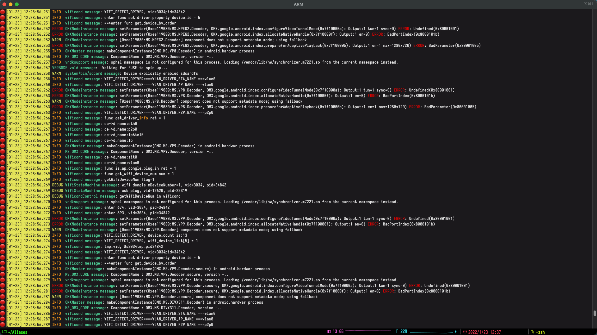

-----------------------------------------------

# Filter by prefix

```
adb logcat | nicelogcat --flat -p Zygote
```


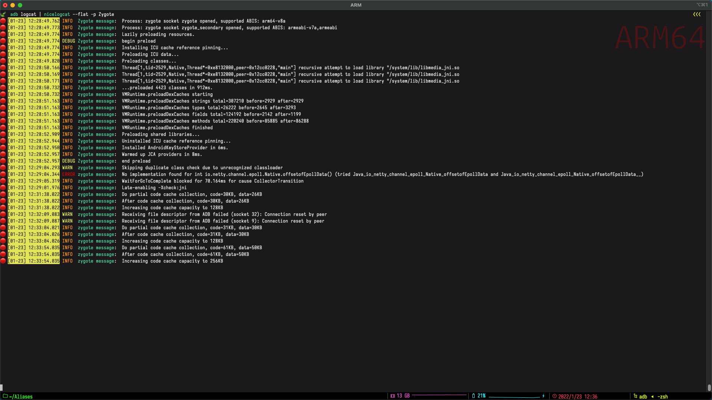


-----------------------------------------------

# Random color for different prefixes

```
adb logcat | nicelogcat --flat --random
```

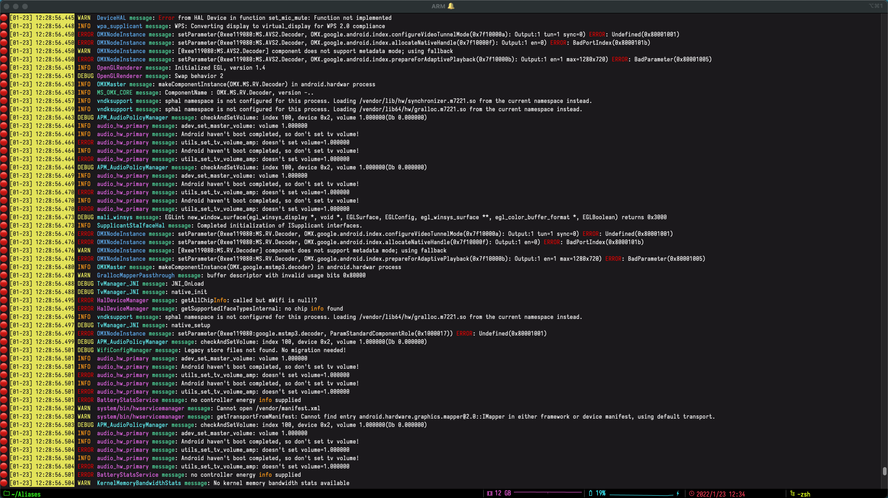

-----------------------------------------------

# Random color for different prefixes and messages

```
adb logcat | nicelogcat --flat --random --random-msg
```

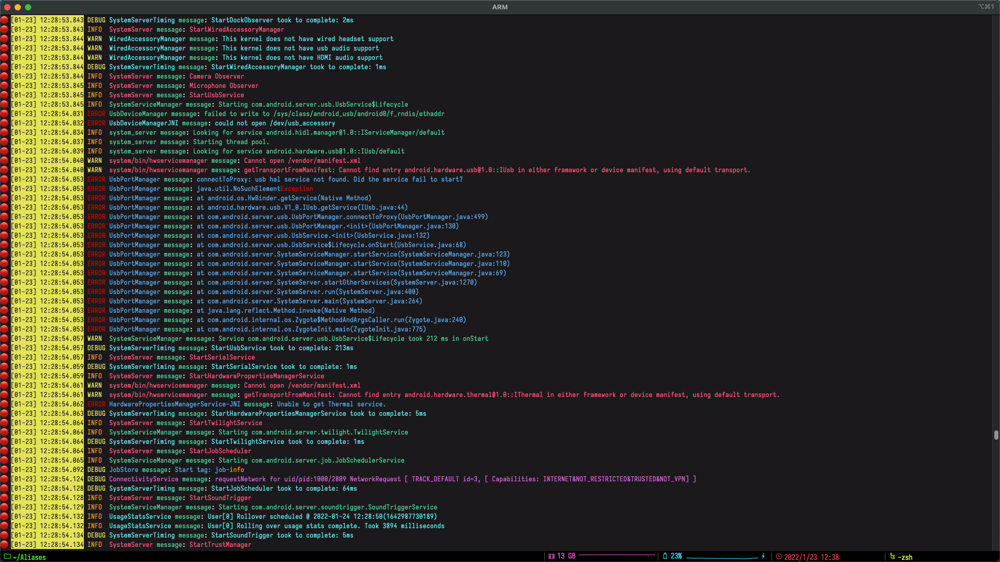

-----------------------------------------------

# Record

Hit f12 while nicelogcatting to start and stop recording and write to a log file


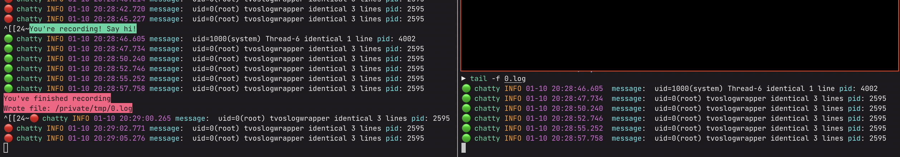

-----------------------------------------------

# Record only when keys change

```
adb logcat | nicelogcat -p Logger --flat
```
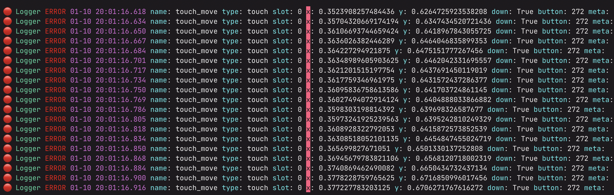

-----------------------------------------------

# Nice Stacktraces

```
adb logcat | nicelogcat --flat --stacktrace --disable
```

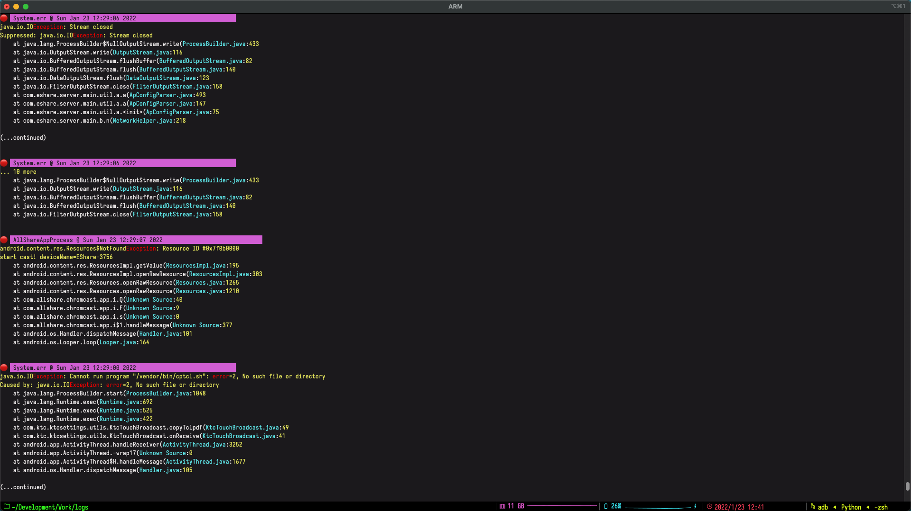


-----------------------------------------------
# All the colors of the Rainbow

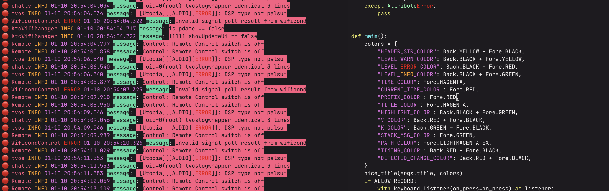


-----------------------------------------------
# Filter

```
adb logcat | nicelogcat --flat -f "isUpdate == true"
```

- Will filter all keys specified

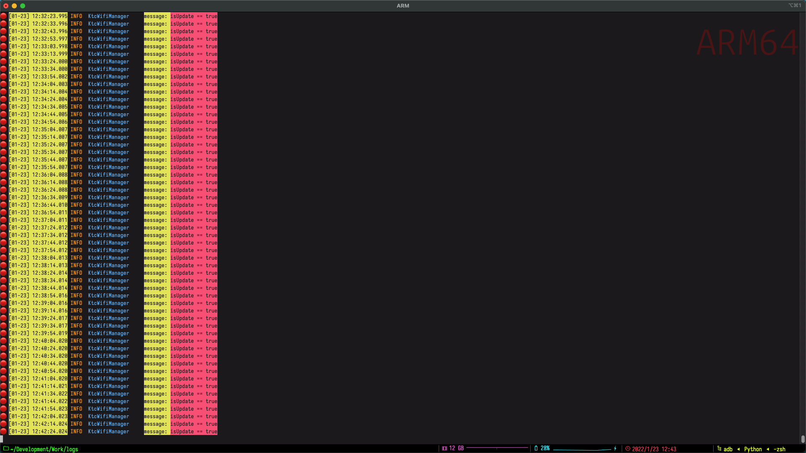

-----------------------------------------------

# Highlight

Maybe you want to just highlight it rather than filter it

```
adb logcat | nicelogcat --flat -h "isUpdate == true"
```


-----------------------------------------------
# Alignment

Some alignment smarts with --align-head

```
adb logcat | nicelogcat --random --random-msg --flat --align-head
```


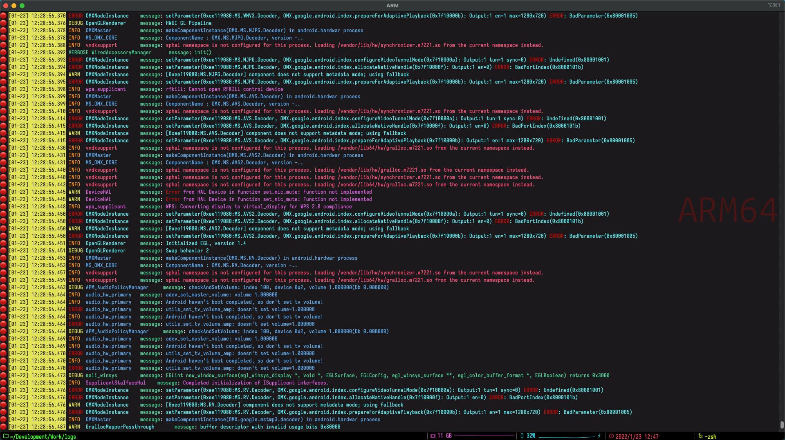


-----------------------------------------------

# Use JSON configs

e.g. see configs/base.json

```json
{
    "--random": true,
    "--flat": true,
    "--align-head": true
}
```

```
adb logcat | nicelogcat base.json
```

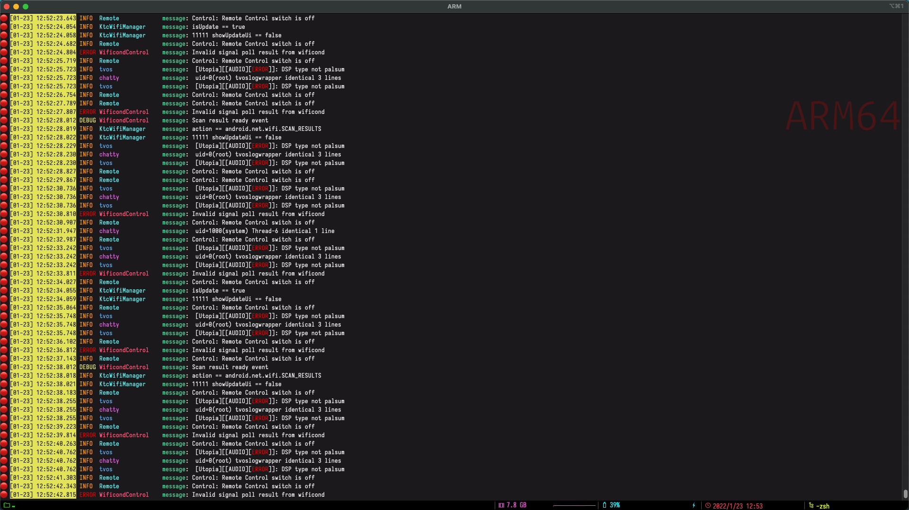


```json
{
    "--stacktrace": true,
    "--disable": true,
    "--linespace": "3"
}
```

```
adb logcat | nicelogcat stacktrace.json
```

You can launch any log within the config-dir without specifying the .json suffix as well

```
adb logcat | nicelogcat stacktrace
```


-----------------------------------------------


# Unify multiple config files


You can also unify two configs by specifying multiple at the command line

base.json

```json
{
    "--random": true,
    "--flat": true,
    "--align-head": true
}
```

/path/to/my/configs/zygote.json

```json
{
    "-p": "Zygote"
}
```

running:

```
adb logcat | nicelogcat --config-dir /path/to/my/configs zygote base
```

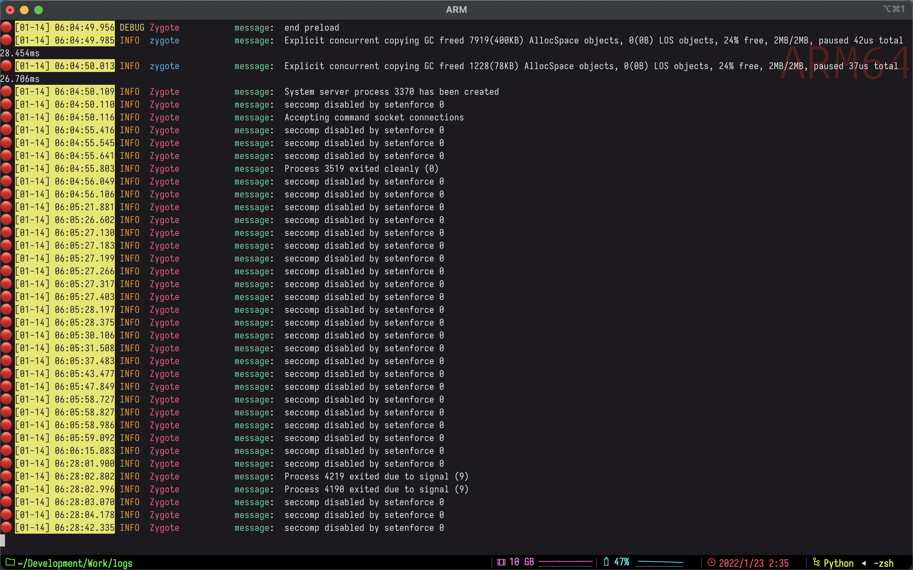


-----------------------------------------------

# Check command args with f11

Pressing f11 while logs are pumping


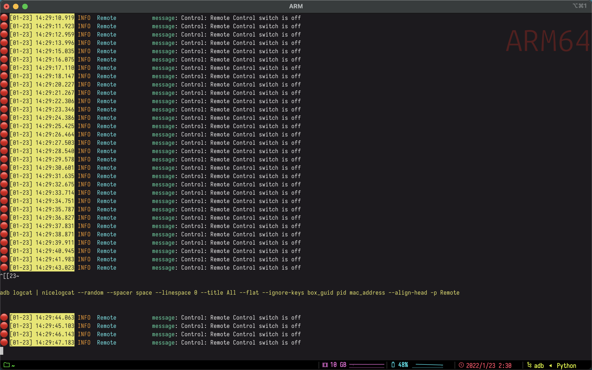