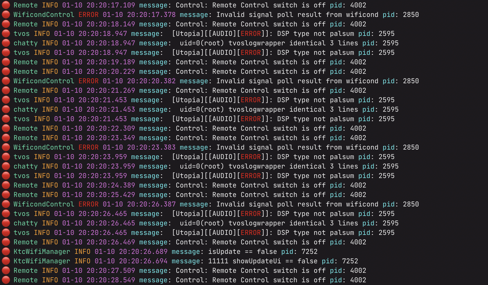
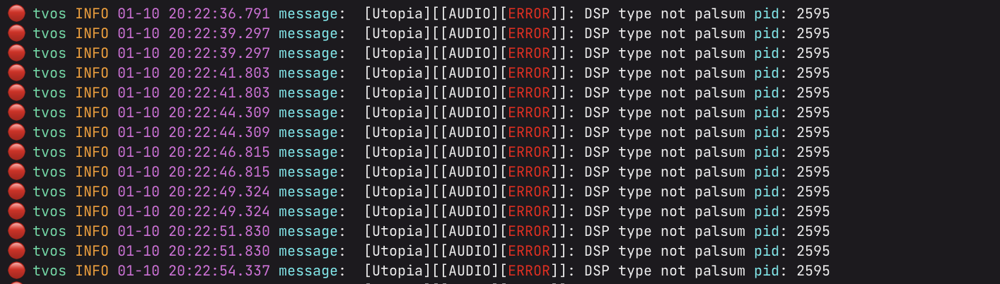

# Nice Log Cat

Just a dog pile of things that help pet the logcat

## Installing

```
pip install -e .
```

## Usage


See `nicelogcat --help` for usage

## Simple

```
adb logcat | nicelogcat --flat
```



## Filter by prefix

```
adb logcat | nicelogcat --flat -p tvos
```




## Record

Hit f12 while nicelogcatting to start and stop recording and write to a log file


## Record only when keys change

```
adb logcat | nicelogcat -p Logger --flat --record-keys x
```


## More!

More hacks and surprises 